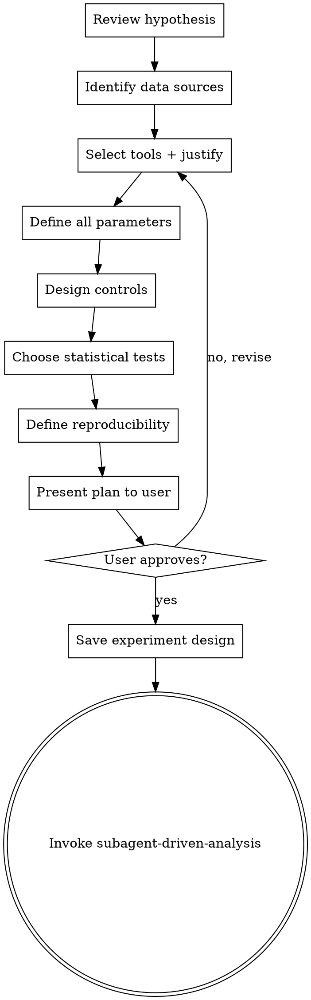

# Experimental Design

## Overview

Transform an approved hypothesis into a detailed, executable computational experiment plan. Every parameter is specified, every tool is chosen with justification, every control is defined, and every statistical test is selected before any analysis begins.

**Core principle:** A good experiment plan is clear enough for an enthusiastic junior bioinformatician with no project context to follow and get the same results.

## When to Use

- After `hypothesis-formulation` has produced an approved hypothesis
- When planning any computational analysis (sequence analysis, structure prediction, expression analysis, etc.)
- When redesigning an experiment after troubleshooting

## When NOT to Use

- Before a hypothesis exists (use `hypothesis-formulation` first)
- For pure data retrieval tasks with no analysis

## Checklist

Complete these steps in order:

1. **Review the hypothesis** — Re-read the approved hypothesis document
2. **Identify data sources** — Where does the data come from? (NCBI, UniProt, PDB, user-provided, etc.)
3. **Select tools and methods** — Which tools/algorithms for each step? Justify choices.
4. **Define parameters** — All parameters explicitly stated (e-value thresholds, gap penalties, model parameters, etc.)
5. **Design controls** — Computational positive and negative controls
6. **Choose statistical tests** — What tests will validate results? What significance threshold?
7. **Define reproducibility requirements** — Random seeds, software versions, data snapshots
8. **Estimate resources** — Time, compute, API calls, data storage
9. **Present the plan** — Section by section, get user approval
10. **Save experiment design** — Write to `docs/experiments/YYYY-MM-DD-<topic>-design.md`
11. **Transition to execution** — Invoke `subagent-driven-analysis`

## Plan Structure

```markdown
# Experiment: [Title]
Date: [YYYY-MM-DD]
Hypothesis: [Link to hypothesis document]

## Data Sources
| Source | Database | Accession/Query | Format | Notes |
|--------|----------|-----------------|--------|-------|
| Target sequence | UniProt | P04637 | FASTA | Human p53 |
| Reference structures | PDB | 1TUP, 2XWR | PDB | Crystal structures |

## Analysis Pipeline
### Step 1: [Name]
- **Tool:** [e.g., BLAST+ 2.14.0, blastp]
- **Parameters:**
  - E-value threshold: 1e-5
  - Word size: 3
  - Matrix: BLOSUM62
  - Gap open: 11, Gap extend: 1
- **Input:** [Source]
- **Expected output:** [Description]
- **Success criteria:** [How to know this step worked]

### Step 2: [Name]
...

## Controls
| Type | Description | Expected Result |
|------|-------------|-----------------|
| Positive | [Known case] | [Expected outcome] |
| Negative | [Known non-case] | [Expected null outcome] |

## Statistical Analysis
- **Primary test:** [e.g., Wilcoxon rank-sum test]
- **Significance threshold:** α = 0.05
- **Multiple testing correction:** [e.g., Benjamini-Hochberg FDR]
- **Effect size measure:** [e.g., Cohen's d]
- **Power analysis:** [if applicable]

## Reproducibility
- **Random seed:** [fixed value]
- **Software versions:** [list all tools + versions]
- **Data snapshot:** [date/version of databases used]
- **Environment:** [Python version, key package versions]

## Resource Estimates
- **Compute time:** [estimate]
- **API calls:** [count and rate limits]
- **Storage:** [data size estimate]
```

## Process Flow



## Key Principles

- **Every parameter explicit** — No defaults left unstated. If using a default, state it.
- **Justify tool choices** — Why BLAST and not HMMER? Why ESMFold and not AlphaFold?
- **Controls are not optional** — Every analysis needs at least one positive and one negative control.
- **Pre-register statistical tests** — Choose tests BEFORE seeing results. No p-hacking.
- **Reproducibility by design** — Fixed seeds, pinned versions, documented provenance.
- **Scale sections to complexity** — A simple BLAST search gets a short plan. A multi-stage pipeline gets a detailed one.

## Common Mistakes

| Mistake | Fix |
|---|---|
| Using tool defaults without stating them | Explicitly list every parameter, even defaults |
| No controls | Define positive and negative controls for every analysis step |
| Choosing stats after seeing results | Pre-register: choose tests and thresholds before analysis |
| Vague success criteria ("good alignment") | Quantify: "alignment identity > 30%, e-value < 1e-10" |
| Missing software versions | Pin every tool version in the reproducibility section |
| Overcomplicating the plan | YAGNI: only include analyses that answer the hypothesis |
