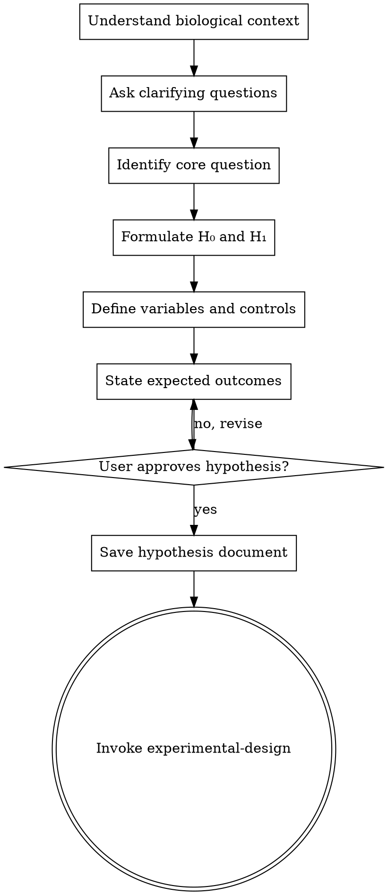

# Hypothesis Formulation

## Overview

Turn vague biological questions into fully formed, testable hypotheses through collaborative dialogue. This is the entry point for ALL biological research — no analysis, no computation, no data retrieval begins until a hypothesis is formulated and approved.

<HARD-GATE>
Do NOT run any analysis, fetch any data, invoke any tool (BLAST, ESMFold, alignment, etc.), or begin any computation until you have presented a hypothesis and the user has approved it. This applies to EVERY research task regardless of perceived simplicity.
</HARD-GATE>

## Anti-Pattern: "This Is Too Simple To Need A Hypothesis"

Every research task goes through this process. A single BLAST search, a quick alignment, a structure prediction — all of them. "Simple" tasks are where unexamined assumptions cause the most wasted computation and misleading conclusions. The hypothesis can be short (one sentence for truly simple questions), but you MUST present it and get approval.

## When to Use

- User asks a biological question ("What mutations would stabilize this protein?")
- User wants to analyze biological data ("Compare these two sequences")
- User wants to predict something ("What's the structure of this protein?")
- User wants to explore ("What genes are differentially expressed in this dataset?")

## When NOT to Use

- Pure data retrieval with no analytical question ("Download the FASTA for P53")
- Tool documentation questions ("How do I use BLAST?")
- Simple format conversions ("Convert this GenBank to FASTA")

## Checklist

You MUST complete these steps in order:

1. **Understand the biological context** — What organism? What system? What's known?
2. **Ask clarifying questions** — One at a time. Prefer multiple choice when possible.
3. **Identify the core question** — What specifically are we trying to learn?
4. **Formulate the hypothesis** — State null (H₀) and alternative (H₁) hypotheses
5. **Define variables** — Independent, dependent, and confounding variables
6. **Define controls** — Positive and negative controls for the computational analysis
7. **State expected outcomes** — What results would support vs. refute the hypothesis?
8. **Get user approval** — Present the hypothesis for sign-off
9. **Save hypothesis document** — Write to `docs/hypotheses/YYYY-MM-DD-<topic>.md`
10. **Transition to experimental design** — Invoke the `experimental-design` skill

## Process Flow



**The terminal state is invoking experimental-design.** Do NOT invoke any analysis skill, run any tool, or fetch any data. The ONLY skill you invoke after hypothesis-formulation is `experimental-design`.

## The Process

### Understanding the context

- What organism or system is involved?
- What is the biological significance?
- What prior work has been done?
- What data or sequences are available?
- Are there known constraints (time, compute, data availability)?

### Asking questions

- **One question at a time** — don't overwhelm
- **Multiple choice preferred** — "Are you interested in (a) protein stability, (b) binding affinity, or (c) catalytic activity?"
- **Probe assumptions** — "You mentioned this protein is unstable — how was that determined?"
- **Clarify scope** — "Are we looking at single-point mutations or combinatorial?"

### Formulating the hypothesis

Present a structured hypothesis:

```
Research Question: [The overarching question]

H₀ (Null):       [No effect / no difference / no relationship]
H₁ (Alternative): [The specific, testable claim]

Independent Variable(s):  [What we're changing/comparing]
Dependent Variable(s):    [What we're measuring]
Confounding Variables:    [What could affect results]

Positive Control: [Known case where H₁ is expected to be true]
Negative Control: [Known case where H₀ is expected to be true]

Expected Outcomes:
  - If H₁ supported: [specific observable result]
  - If H₀ not rejected: [specific observable result]
```

### Getting approval

- Present the hypothesis in a clear, readable format
- Ask: "Does this capture what you're trying to investigate?"
- Be ready to revise — hypotheses often need 2–3 iterations
- Only proceed when user explicitly approves

## After the Hypothesis

**Documentation:**
- Save to `docs/hypotheses/YYYY-MM-DD-<topic>.md`
- Include all elements: question, hypotheses, variables, controls, expected outcomes
- Commit to git if in a versioned project

**Next step:**
- Invoke the `experimental-design` skill to plan the computational approach
- Do NOT invoke any other skill. `experimental-design` is the next step.

## Key Principles

- **One question at a time** — Don't overwhelm with multiple questions
- **Testable and falsifiable** — If you can't state what would disprove it, it's not a hypothesis
- **Specific and measurable** — Avoid vague hypotheses ("this protein is important")
- **Controls are mandatory** — Every computational analysis needs positive and negative controls
- **YAGNI for biology** — Scope the hypothesis tightly; don't try to answer everything at once
- **No fishing expeditions** — If the user wants to "just explore," help them formulate what they'd do with what they find

## Common Mistakes

| Mistake | Fix |
|---|---|
| "Let's just run BLAST and see" | Formulate what you expect to find and why |
| Hypothesis is not falsifiable | Restate with specific, measurable criteria |
| No controls defined | Always define what a known positive and negative would look like |
| Too broad ("understand this protein") | Narrow to a specific, testable aspect |
| Skipping for "simple" tasks | Simple tasks need simple hypotheses, but they still need one |
